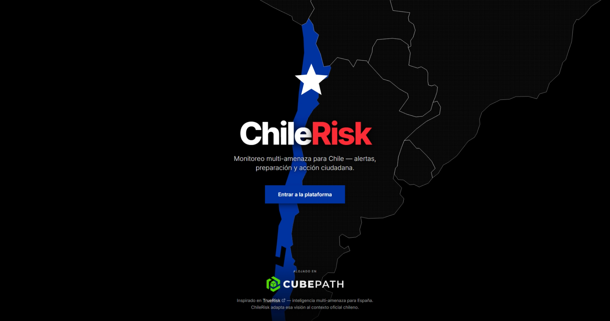
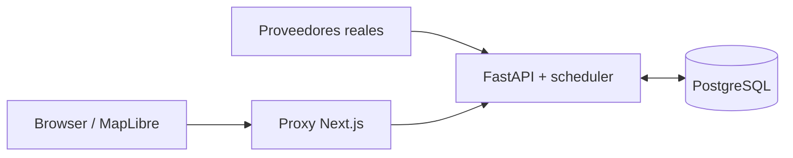

<div align="center">



[](https://python.org)
[](https://nextjs.org)
[](https://react.dev)
[](https://postgresql.org)

# ChileRisk

**Monitor ciudadano multi-amenaza para Chile:** ayuda a consultar riesgo, alertas oficiales y preparación para las 16 regiones y 346 comunas. El producto usa únicamente datos reales; si una fuente no responde, no inventa valores de reemplazo.

[Destino configurado](https://chilerisk.cl) · [API local](http://localhost:8000/docs) · [Arquitectura](docs/ARCHITECTURE.md)

</div>

---

## Disponible hoy en la web

Estas superficies están implementadas y pueden comprobarse en el frontend:

| Ruta | Qué ofrece |
|------|------------|
| `/` | Landing del producto |
| `/monitor` | Mapa multi-amenaza con riesgo, alertas, fecha, sismos y calidad del aire |
| `/evacuacion` | Capas oficiales de evacuación y puntos de encuentro cercanos |
| `/desastres` | Catálogo vendoreado de 25 guías SENAPRED |
| `/desastres/[tipo]` | Detalle estático de cada guía de desastre |
| `/simulacros` | Calendario de simulacros SENAPRED |

El monitor usa una fecha civil de Chile dentro de una ventana de 30 días. En una fecha pasada, las franjas oficiales de MeteoChile no se dibujan: el endpoint de zonas devuelve una `FeatureCollection` vacía.

## Backend implementado, UI pendiente

El backend ya expone capacidades que todavía no tienen una superficie web completa: autenticación, resumen IA del dashboard, Plan Familia, chat ciudadano y perfil de usuario. La ausencia de UI no implica que el API esté terminado como producto ciudadano.

### `stub`: rutas visibles con “Próximamente”

- `/inicio`
- `/preparacion`
- `/asistente`
- `/cuenta`

### `ausente`: rutas todavía no implementadas

- `/iniciar-sesion`
- `/registro`
- `/olvide-contrasena`
- `/restablecer-contrasena`
- `/preparacion/kit-emergencia`
- `/preparacion/plan-familia/paso/[n]`

El CTA de la landing apunta a `/iniciar-sesion`, pero esa ruta está clasificada como `ausente`; no se presenta como una pantalla disponible.

---

## Arquitectura y fuentes

Los dos flujos operativos son deliberadamente separados: el navegador nunca conecta directamente con PostgreSQL.



- **Proveedores → FastAPI/scheduler ↔ PostgreSQL:** CSN, Open-Meteo y GloFAS, SERNAPRED, SERNAGEOMIN, Aire Chile y MeteoChile AAA alimentan ingestas, snapshots y alertas.
- **Browser/MapLibre → proxy Next → FastAPI:** la UI consume HTTP mediante `frontend/lib/api.ts`; nunca accede a la base de datos.
- **Datos estáticos del frontend:** GeoJSON y PMTiles vendoreados viven en `frontend/public/data/`; no son ingestas del backend. Las guías SENAPRED también usan snapshots comprometidos en el frontend.

El detalle de topología, scheduler, puertos y despliegue está en [docs/ARCHITECTURE.md](docs/ARCHITECTURE.md). La especificación visual detallada y canónica es [frontend/docs/UI-GUIDELINES.md](frontend/docs/UI-GUIDELINES.md); [frontend/DESIGN.md](frontend/DESIGN.md) es su proyección portable para Impeccable y no reemplaza la guía operativa.

### Fuentes verificadas

| Fuente | Uso |
|--------|-----|
| [CSN](https://www.sismologia.cl) | Eventos sísmicos e impactos territoriales |
| [Open-Meteo](https://open-meteo.com) / [GloFAS](https://www.globalfloods.eu/) | Clima e inundación fluvial |
| [SERNAPRED](https://senapred.cl) | Alertas, eventos, simulacros y contenido oficial |
| [SERNAGEOMIN](https://www.sernageomin.cl/alertas-volcanicas/) | Alertas volcánicas OVDAS |
| [Aire Chile](https://airechile.mma.gob.cl/) | Condiciones GEC en zonas PPDA |
| [MeteoChile AAA](https://archivos.meteochile.gob.cl/portaldmc/AAA/datos_AAA.json) | Avisos, Alertas y Alarmas DMC |

## Optimizaciones implementadas

Estas son decisiones comprobables de código o configuración, no promesas de latencia:

- Mapas pesados se cargan con `next/dynamic({ ssr: false })` en `/monitor`.
- Los polígonos grandes de evacuación se sirven como PMTiles; líneas y puntos permanecen en GeoJSON.
- `setData` carga la geometría y `feature-state` cambia niveles de alerta o aire sin recargarla.
- TanStack Query usa TTL corto para hoy y TTL histórico diferenciado mediante `staleTimeForLive`.
- Los impactos sísmicos se precalculan al ingresar el evento y se reutilizan al recalcular riesgo.
- Las consultas Open-Meteo usan lotes; GloFAS usa lotes de 20 con corte ante HTTP 429.
- El riesgo histórico usa snapshots diarios serializados y protegidos por caché/lock por fecha.
- Los cuerpos pesados de alertas son opt-in: `/alerts/active` mantiene `include_content=false` por defecto.

Anclas de implementación: [frontend/docs/FRONTEND.md](frontend/docs/FRONTEND.md), [backend/docs/BACKEND.md](backend/docs/BACKEND.md), `frontend/components/map/chile-map.tsx` y `backend/app/services/impact_service.py`.

---

## Inicio rápido

Requisitos: Docker con Compose para el camino recomendado; Bun para frontend nativo; Python 3.12 para backend nativo.

```bash
# Desde la raíz
cp .env.example .env

# Solo si ejecutarás el backend de forma nativa
cp backend/.env.example backend/.env

# Stack completo: docker compose --profile tools up --build
make up
```

`make up` inicia frontend en [http://localhost:3000](http://localhost:3000), backend en [http://localhost:8000/docs](http://localhost:8000/docs), OpenAPI en [http://localhost:8000/openapi.json](http://localhost:8000/openapi.json) y Adminer en [http://localhost:8080](http://localhost:8080). El puerto host de PostgreSQL es `127.0.0.1:5434`.

Para desarrollo nativo:

```bash
make dev-backend   # requiere DB disponible
make dev-frontend  # equivale a cd frontend && bun run dev
```

El destino de despliegue configurado es [chilerisk.cl](https://chilerisk.cl) mediante Docker Compose. La disponibilidad se comprueba con el stack local, no con el enlace externo.

## Verificación

```bash
make verify          # enlaces, contrato, lint/tsc/tests y compileall; no ejecuta el build de Next
make verify-docs     # enlaces Markdown locales
make verify-contract # OpenAPI → frontend/lib/api-schema.d.ts
make verify-frontend # lint + tsc + bun test
make verify-backend  # compileall + pytest si está instalado
cd frontend && bun run build
```

---

## Navegación por lector

| Necesitas… | Lee solo esto |
|------------|---------------|
| Entender el estado del producto y sus rutas | Este README |
| Entrar al monorepo como agente | [AGENTS.md](AGENTS.md) |
| Ver arquitectura, puertos, scheduler y despliegue | [docs/ARCHITECTURE.md](docs/ARCHITECTURE.md) |
| Seguir un playbook de implementación | [docs/HARNESS.md](docs/HARNESS.md) |
| Mantener documentación y evidencia | [docs/DOC-MAINTENANCE.md](docs/DOC-MAINTENANCE.md) |
| Entender `?date=` de extremo a extremo | [docs/QUERY-DATE.md](docs/QUERY-DATE.md) |
| Trabajar en frontend | [frontend/README.md](frontend/README.md) |
| Implementar UI visual | [frontend/docs/UI-GUIDELINES.md](frontend/docs/UI-GUIDELINES.md) |
| Consultar el contexto portable de Impeccable | [frontend/DESIGN.md](frontend/DESIGN.md) |
| Trabajar en backend o revisar OpenAPI | [backend/docs/BACKEND.md](backend/docs/BACKEND.md) |

---

## Acknowledgments

- Inspirado en **[TrueRisk](https://truerisk.cloud/)** ([repo](https://github.com/javierdejesusda/TrueRisk)), plataforma hermana de riesgo multi-amenaza para España.
- Alojamiento e infraestructura: **[CubePath](https://cubepath.com)**.
- Fuentes oficiales y operativas: CSN, SERNAPRED, SERNAGEOMIN, MMA Aire Chile, Open-Meteo/GloFAS y MeteoChile.

*Last updated: 2026-08-07*
