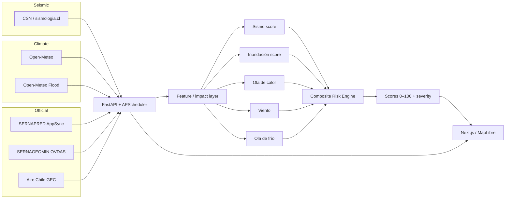

<div align="center">


[](https://python.org)
[](https://nextjs.org)
[](https://react.dev)
[](https://postgresql.org)

**Plataforma de inteligencia de riesgo multi-amenaza para Chile:** monitoreo en tiempo real, puntajes 0–100 por comuna, alertas oficiales unificadas y guía ciudadana de preparación — 16 regiones, 346 comunas.

[Plataforma](https://chilerisk.cl) · [API Docs](http://localhost:8000/docs) · [Arquitectura](docs/ARCHITECTURE.md) · [Inspirado en TrueRisk](https://truerisk.cloud/)

</div>

---

## Features

- **5 hazards con score 0–100** — Sismo, inundación, ola de calor, viento y ola de frío, por cada una de las 346 comunas
- **Fusión de datos reales** — CSN (sismologia.cl), Open-Meteo (clima + Flood/GloFAS), SERNAPRED (AppSync), SERNAGEOMIN (OVDAS) y Aire Chile (GEC / MMA)
- **Mapa interactivo** — MapLibre GL con coropleta de riesgo, modos Riesgo / Alertas / Aire, marcadores sísmicos y consulta histórica `?date=` (30 días)
- **Alertas unificadas** — SERNAPRED + umbrales ChileRisk + volcanes SERNAGEOMIN en un solo feed filtrable
- **Dashboard ciudadano** — Resumen IA del día (DeepSeek), tarjeta “Mi comuna hoy”, sismos relevantes y atajos a mapa / plan
- **Asistente de emergencia** — Chat con tools (DeepSeek) contextualizado a ubicación, alertas y riesgo
- **Preparación familiar** — Plan Familia (8 pasos), kit de emergencia, guías por tipo de desastre y calendario de simulacros SERNAPRED
- **Evacuación tsunami** — Capas oficiales, geolocalización y puntos de encuentro cercanos
- **Modo emergencia** — Banner reactivo ante alertas naranja/roja aplicables a la comuna del usuario
- **Auth** — NextAuth v5 + JWT FastAPI (email/contraseña; Google OAuth opcional)
- **Datos reales solamente** — Si una fuente no responde, no se generan datos de reemplazo

---

## Architecture



---

## Risk Engine

Motor **determinístico** (reglas + pesos).

| Hazard | Fuente principal | Método |
|--------|------------------|--------|
| Sismo | CSN → impactos por comuna | Distancia + intensidad estimada → score |
| Inundación | Open-Meteo Flood (GloFAS) | Descarga fluvial / batch comunas |
| Ola de calor | Open-Meteo | Umbrales de temperatura |
| Viento | Open-Meteo | Umbrales de viento |
| Ola de frío | Open-Meteo | Umbrales de temperatura |

### Pipeline

1. **Ingesta** — Scheduler (CSN, meteo, flood, SERNAPRED, Aire Chile, SERNAGEOMIN)
2. **Impacto sísmico** — Evento → `seismic_impacts` (hasta 50 comunas)
3. **Scores live** — `risk_service.recompute_all_scores` cada N minutos
4. **Histórico** — `daily_risk_scores` materializados bajo demanda por `?date=`
5. **Alertas** — Evaluador ChileRisk + sync oficiales → `GET /api/v1/alerts/active`
6. **Frontend** — React Query + proxy `/api/backend` → FastAPI (nunca Postgres desde el FE)

### Composite (0–100)

Pesos base en `risk_utils.HAZARD_WEIGHTS` (el hazard dominante recibe bonus según severidad):

| Peso | Hazard |
|------|--------|
| 1.5 | Sismo |
| 1.2 | Inundación |
| 1.0 | Ola de calor |
| 0.8 | Viento |
| 0.6 | Ola de frío |

Severidad: `bajo` &lt; 35 · `moderado` &lt; 55 · `alto` &lt; 75 · `critico` ≥ 75.

---

## Tech Stack

### Frontend

| Technology | Version |
|------------|---------|
| [Next.js](https://nextjs.org) | 16 |
| [React](https://react.dev) | 19 |
| [TypeScript](https://typescriptlang.org) | 5 |
| [Tailwind CSS](https://tailwindcss.com) | 4 |
| [MapLibre GL](https://maplibre.org) | 5 |
| [Motion](https://motion.dev) | 12 |
| [Zustand](https://zustand.docs.pmnd.rs) | 5 |
| [TanStack Query](https://tanstack.com/query) | 5 |
| [NextAuth](https://authjs.dev) | 5 (beta) |
| [Three.js / R3F](https://docs.pmnd.rs/react-three-fiber) | Globo landing |

### Backend

| Technology | Version |
|------------|---------|
| [Python](https://python.org) | 3.12 |
| [FastAPI](https://fastapi.tiangolo.com) | 0.115+ |
| [SQLAlchemy](https://sqlalchemy.org) | 2.0+ (async) |
| [Alembic](https://alembic.sqlalchemy.org) | 1.14+ |
| [APScheduler](https://apscheduler.readthedocs.io) | 3.10 |
| [httpx](https://www.python-httpx.org) | 0.28+ |
| [DeepSeek](https://www.deepseek.com) (OpenAI-compatible) | Chat + resumen dashboard |

### Infrastructure

| Technology | Purpose |
|------------|---------|
| PostgreSQL 16 | Geo, scores live/históricos, eventos, alertas, usuarios |
| Docker Compose | Stack local y deploy (Dokploy / CubePath) |
| `make verify` | Harness: links + contrato OpenAPI + lint/tsc + compileall |

### Data Sources

| Source | Data | Notes |
|--------|------|-------|
| [CSN / sismologia.cl](https://www.sismologia.cl) | Catálogo sísmico reciente | Scrape |
| [Open-Meteo](https://open-meteo.com) | Clima por comuna | Batch REST |
| [Open-Meteo Flood](https://open-meteo.com/en/docs/flood-api) | Riesgo de inundación (GloFAS) | Background sync |
| [SERNAPRED](https://senapred.cl) | Alertas ATP + eventos + simulacros | Cognito anónimo + AppSync / scrape |
| [SERNAGEOMIN](https://www.sernageomin.cl/alertas-volcanicas/) | Alertas volcánicas OVDAS | Scrape HTML |
| [Aire Chile](https://airechile.mma.gob.cl/) | Condiciones GEC (zonas PPDA) | Scrape; cobertura parcial |

---

## Prerequisites

- **Docker** + Docker Compose (camino recomendado)
- **Bun** (frontend nativo) y **Python 3.12+** (backend nativo)
- **PostgreSQL 16+** (incluido en Compose)
- **API keys (opcionales):**
  - `DEEPSEEK_API_KEY` — asistente + resumen del dashboard
  - `RESEND_API_KEY` — reset de contraseña por email
  - `GOOGLE_CLIENT_ID` / `GOOGLE_CLIENT_SECRET` — OAuth Google

---

## Getting Started

### 1. Clone

```bash
git clone git@github.com:Alphabeath/ChileRisk.git
cd ChileRisk
```

### 2. Environment

```bash
cp .env.example .env
# Opcional nativo:
cp backend/.env.example backend/.env
cp frontend/.env.example frontend/.env.local   # si existe
```

Genera un `AUTH_SECRET` ≥ 32 bytes:

```bash
openssl rand -base64 48
```

### 3. Full stack (Docker)

```bash
make up
# equivale a: docker compose --profile tools up --build
```

| Service | URL |
|---------|-----|
| Frontend | [http://localhost:3000](http://localhost:3000) |
| Backend / Swagger | [http://localhost:8000/docs](http://localhost:8000/docs) |
| OpenAPI | [http://localhost:8000/openapi.json](http://localhost:8000/openapi.json) |
| Adminer (profile `tools`) | [http://localhost:8080](http://localhost:8080) |
| Postgres (host) | `127.0.0.1:5434` |

### 4. Native (opcional)

```bash
# Terminal A — API (requiere DATABASE_URL)
make dev-backend

# Terminal B — Next.js
make dev-frontend
```

### Deploy

Producción en **[chilerisk.cl](https://chilerisk.cl)** vía Docker Compose (Dokploy / CubePath). Detalle DNS, env y healthchecks: [docs/ARCHITECTURE.md](docs/ARCHITECTURE.md).

---

## Testing / verify

```bash
# Gate completo del monorepo
make verify

# Por área
make verify-frontend   # eslint + tsc + bun test
make verify-backend    # compileall (+ pytest si aplica)
make verify-contract   # OpenAPI ↔ frontend/lib/api-schema.d.ts
make verify-docs       # links de documentación
```

---

## API Endpoints

Prefijo `/api/v1`. Contrato canónico: OpenAPI en runtime. Resumen humano: [backend/docs/BACKEND.md](backend/docs/BACKEND.md).

| Route | Description |
|-------|-------------|
| `/health` | Health + resumen de syncs (público) |
| `/api/v1/auth/*` | Registro, credentials, OAuth Google, reset password |
| `/api/v1/risk/national` · `/risk/comunas` | Riesgo agregado / scores por comuna (`?date=`; mapa pinta por alertas) |
| `/api/v1/comunas/{cod}/risk` · `/nearest` | Vector de hazards / comuna GPS |
| `/api/v1/events` · `/events/{id}/impact` | Sismos del día + impacto territorial |
| `/api/v1/alerts/active` | SERNAPRED + ChileRisk + SERNAGEOMIN |
| `/api/v1/air-quality` · `/by-comuna/{cod}` | GEC Aire Chile |
| `/api/v1/stats/*` | Nacional, regional, compare |
| `/api/v1/dashboard/summary` | Resumen IA del día |
| `/api/v1/chat` · `/chat/stream` | Asistente (JSON / SSE) |
| `/api/v1/family-plan` | Plan Familia Preparada |
| `/api/v1/simulacros` | Calendario SERNAPRED |
| `/api/v1/meeting-points/nearest` | Puntos de encuentro |
| `/api/v1/disaster-guides` | Guías estáticas de preparación |
| `/api/v1/users/me` | Perfil + comuna de hogar |
| `/api/v1/system/sync-status` | Estado de jobs del scheduler |

Parámetro `date`: día civil Chile (`YYYY-MM-DD`), ventana 30 días — [QUERY-DATE.md](docs/QUERY-DATE.md).

---

## Project Structure

```
├── frontend/                 # Next.js 16 (App Router) + MapLibre
│   ├── app/
│   │   ├── (auth)/           # Login, registro, reset
│   │   ├── (citizen)/        # Dashboard, monitor, preparación, evacuación…
│   │   └── api/              # NextAuth + proxy /api/backend
│   ├── components/           # UI mapa, dashboard, preparación, auth
│   ├── hooks/                # React Query + dominio
│   ├── lib/                  # api.ts, types, glass/mica, query-date
│   └── docs/                 # FRONTEND.md, DESIGN.md
├── backend/
│   ├── app/
│   │   ├── api/              # Routers FastAPI
│   │   ├── models/           # SQLAlchemy ORM
│   │   ├── schemas/          # Pydantic (contrato FE↔BE)
│   │   ├── services/         # Riesgo, syncs, chat, dashboard
│   │   ├── scheduler/        # APScheduler jobs
│   │   └── data/             # Geografía y catálogos oficiales
│   ├── alembic/              # Migraciones
│   └── docs/                 # BACKEND.md
├── docs/                     # Arquitectura, harness, query-date
├── docker-compose.yml
├── Makefile                  # up, verify, sync-contract, …
└── AGENTS.md                 # Bootstrap para agentes / contributors
```

---

## Documentation

| Doc | Role |
|-----|------|
| [AGENTS.md](AGENTS.md) | Scope monorepo + contrato FE↔BE |
| [docs/ARCHITECTURE.md](docs/ARCHITECTURE.md) | Sistema, puertos, Dokploy |
| [docs/HARNESS.md](docs/HARNESS.md) | Playbooks + `make verify` |
| [docs/QUERY-DATE.md](docs/QUERY-DATE.md) | Semántica de `?date=` |
| [backend/docs/BACKEND.md](backend/docs/BACKEND.md) | API, modelos, env |
| [frontend/docs/FRONTEND.md](frontend/docs/FRONTEND.md) | Componentes, mapa, hooks |
| [frontend/docs/DESIGN.md](frontend/docs/DESIGN.md) | Glass, mica, tokens citizen |

---

## Acknowledgments

- Inspirado en **[TrueRisk](https://truerisk.cloud/)** ([repo](https://github.com/javierdejesusda/TrueRisk)) — plataforma hermana de riesgo multi-amenaza para España.
- Alojamiento / infra: **[CubePath](https://cubepath.com)**.
- Fuentes oficiales: CSN, SERNAPRED, SERNAGEOMIN, MMA Aire Chile, Open-Meteo.

---

## License

Uso y distribución sujetos a los términos del repositorio del equipo. Si publicas el código bajo una licencia abierta, añade un `LICENSE` en la raíz y actualiza este apartado.
