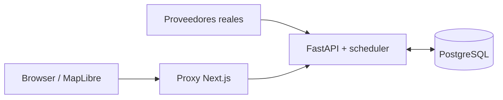

<div align="center">


[](https://python.org)
[](https://nextjs.org)
[](https://react.dev)
[](https://postgresql.org)

# ChileRisk

**Monitor ciudadano multi-amenaza para Chile:** ayuda a consultar riesgo, alertas oficiales y preparación para las 16 regiones y 346 comunas. El producto usa únicamente datos reales; si una fuente no responde, no inventa valores de reemplazo.

[Destino configurado](https://chilerisk.cl) · [API local](http://localhost:8000/docs) · [Arquitectura](docs/ARCHITECTURE.md)

</div>

---

## Estado del producto

La matriz canónica de rutas, con evidencia `disponible`, `stub` y `ausente`, vive en [frontend/docs/FRONTEND.md#estado-de-rutas](frontend/docs/FRONTEND.md#estado-de-rutas).

La separación entre API consumida por la web y capacidades `backend-only` vive en [backend/docs/BACKEND.md#api-consumida-por-la-web--api-backend-only](backend/docs/BACKEND.md#api-consumida-por-la-web--api-backend-only).

Este README resume el producto y enlaza a esos owners; no mantiene inventarios paralelos.

El monitor usa una fecha civil de Chile dentro de una ventana de 30 días. En una fecha pasada, las franjas oficiales de MeteoChile no se dibujan: el endpoint de zonas devuelve una `FeatureCollection` vacía.

---

## Arquitectura y fuentes

Los dos flujos operativos son deliberadamente separados: el navegador nunca conecta directamente con PostgreSQL.



- **Proveedores → FastAPI/scheduler ↔ PostgreSQL:** CSN, Open-Meteo y GloFAS, SERNAPRED, SERNAGEOMIN, Aire Chile y MeteoChile AAA alimentan ingestas, snapshots y alertas.
- **Browser/MapLibre → proxy Next → FastAPI:** la UI consume HTTP mediante `frontend/lib/api.ts`; nunca accede a la base de datos.
- **Datos estáticos del frontend:** GeoJSON y PMTiles vendoreados viven en `frontend/public/data/`; no son ingestas del backend. Las guías SENAPRED también usan snapshots comprometidos en el frontend.

El detalle de topología, scheduler, puertos y despliegue está en [docs/ARCHITECTURE.md](docs/ARCHITECTURE.md). La especificación visual detallada y canónica es [frontend/docs/UI-GUIDELINES.md](frontend/docs/UI-GUIDELINES.md); [frontend/DESIGN.md](frontend/DESIGN.md) es su proyección portable para Impeccable y no reemplaza la guía operativa.

### Fuentes verificadas

| Fuente | Uso |
|--------|-----|
| [CSN](https://www.sismologia.cl) | Eventos sísmicos e impactos territoriales |
| [Open-Meteo](https://open-meteo.com) / [GloFAS](https://www.globalfloods.eu/) | Clima e inundación fluvial |
| [SERNAPRED](https://senapred.cl) | Alertas, eventos, simulacros y contenido oficial |
| [SERNAGEOMIN](https://www.sernageomin.cl/alertas-volcanicas/) | Alertas volcánicas OVDAS |
| [Aire Chile](https://airechile.mma.gob.cl/) | Condiciones GEC en zonas PPDA |
| [MeteoChile AAA](https://archivos.meteochile.gob.cl/portaldmc/AAA/datos_AAA.json) | Avisos, Alertas y Alarmas DMC |

## Optimizaciones arquitectónicas

Las decisiones comprobables de código y configuración están en [docs/ARCHITECTURE.md#optimizaciones-arquitectónicas](docs/ARCHITECTURE.md#optimizaciones-arquitectónicas). Esa tabla es el único inventario cross-stack; no se replica aquí.

---

## Inicio rápido

Requisitos: Docker con Compose para el camino recomendado; Bun para frontend nativo; Python 3.12 para backend nativo.

```bash
# Desde la raíz
cp .env.example .env

# Solo si ejecutarás el backend de forma nativa
cp backend/.env.example backend/.env

# Stack completo en segundo plano: docker compose --profile tools up --build --detach
make up
```

`make up` inicia el stack en segundo plano: frontend en [http://localhost:3000](http://localhost:3000), backend en [http://localhost:8000/docs](http://localhost:8000/docs), OpenAPI en [http://localhost:8000/openapi.json](http://localhost:8000/openapi.json) y Adminer en [http://localhost:8080](http://localhost:8080). El puerto host de PostgreSQL es `127.0.0.1:5434`.

Para desarrollo nativo:

```bash
make dev-backend
make dev-frontend
```

El destino de despliegue configurado es [chilerisk.cl](https://chilerisk.cl) mediante Docker Compose. La disponibilidad se comprueba con el stack local, no con el enlace externo.

## Verificación

```bash
make verify
cd frontend && bun run build
```

`make verify` ejecuta los subgates de enlaces, contrato, frontend y backend. El build de Next se ejecuta aparte porque no forma parte de `make verify`.

---

## Navegación por lector

| Necesitas… | Lee solo esto |
|------------|---------------|
| Entrar al monorepo como agente | [AGENTS.md](AGENTS.md) |
| Elegir routing y scope frontend | [frontend/AGENTS.md](frontend/AGENTS.md) |
| Elegir routing y scope backend | [backend/AGENTS.md](backend/AGENTS.md) |
| Ver arquitectura, puertos, scheduler y despliegue | [docs/ARCHITECTURE.md](docs/ARCHITECTURE.md) |
| Seguir el flujo de contrato FE↔BE cuando aplique | [docs/CONTRACT.md](docs/CONTRACT.md) |
| Mantener documentación y evidencia | [docs/DOC-MAINTENANCE.md](docs/DOC-MAINTENANCE.md) |
| Entender `?date=` de extremo a extremo | [docs/QUERY-DATE.md](docs/QUERY-DATE.md) |
| Estado, componentes y rutas frontend | [frontend/docs/FRONTEND.md](frontend/docs/FRONTEND.md) |
| Implementar UI visual | [frontend/docs/UI-GUIDELINES.md](frontend/docs/UI-GUIDELINES.md) |
| Contexto portable de Impeccable | [frontend/DESIGN.md](frontend/DESIGN.md) |
| Propósito y compromisos de producto | [frontend/PRODUCT.md](frontend/PRODUCT.md) |
| API, fuentes y scheduler backend | [backend/docs/BACKEND.md](backend/docs/BACKEND.md) |

---

## Acknowledgments

- Inspirado en **[TrueRisk](https://truerisk.cloud/)** ([repo](https://github.com/javierdejesusda/TrueRisk)), plataforma hermana de riesgo multi-amenaza para España.
- Alojamiento e infraestructura: **[CubePath](https://cubepath.com)**.
- Fuentes oficiales y operativas: CSN, SERNAPRED, SERNAGEOMIN, MMA Aire Chile, Open-Meteo/GloFAS y MeteoChile.

*Last updated: 2026-08-12*
