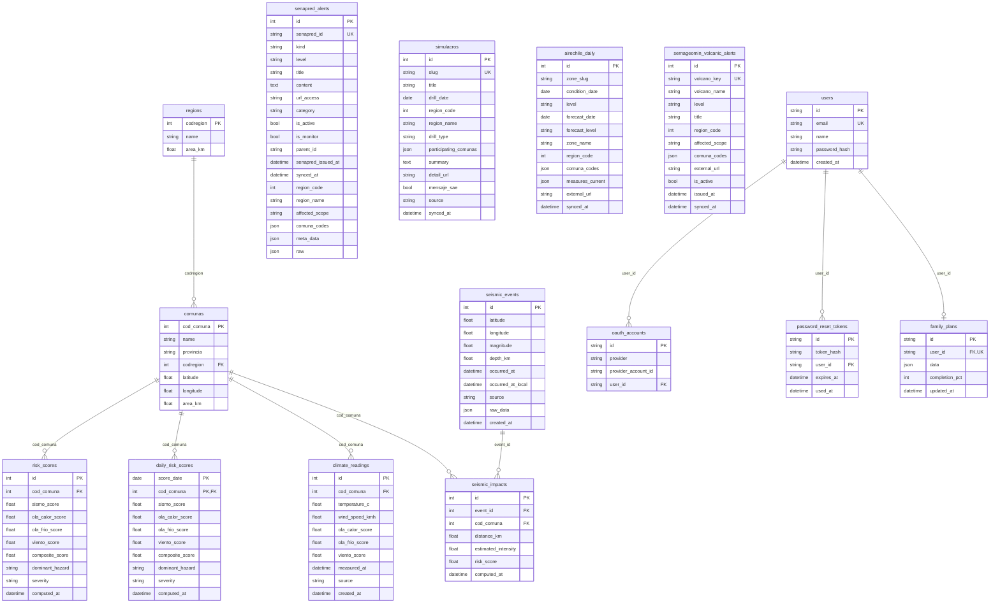
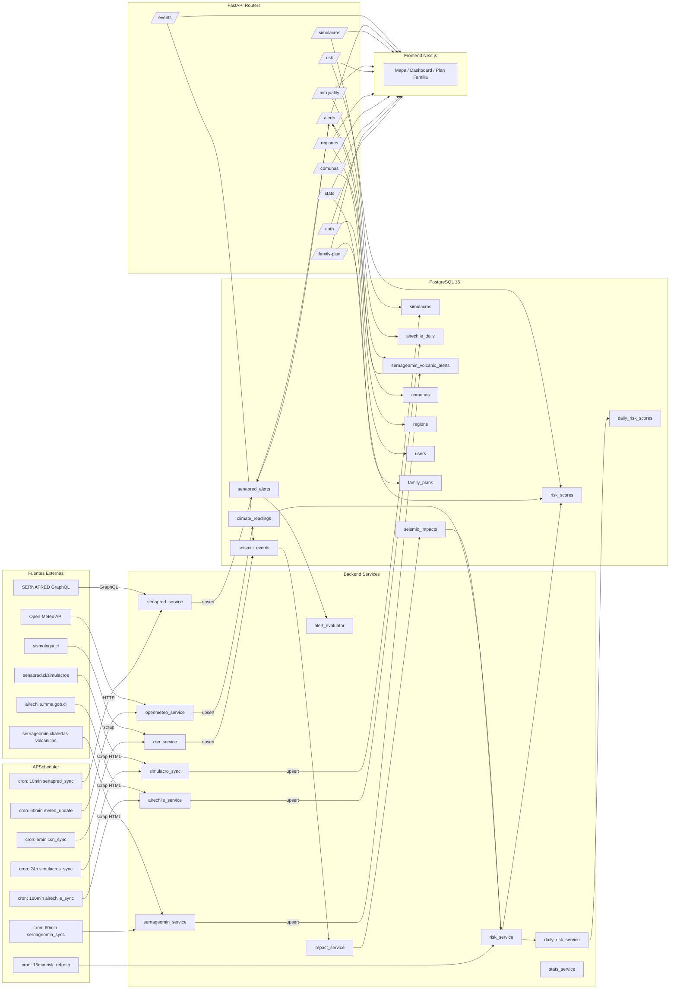

# Base de Datos — ChileRisk

## Diagrama ER

```mermaid
erDiagram
    regions {
        int codregion PK
        string name
        float area_km
    }

    comunas {
        int cod_comuna PK
        string name
        string provincia
        int codregion FK
        float latitude
        float longitude
        float area_km
    }

    risk_scores {
        int id PK
        int cod_comuna FK
        float sismo_score
        float ola_calor_score
        float ola_frio_score
        float viento_score
        float composite_score
        string dominant_hazard
        string severity
        datetime computed_at
    }

    daily_risk_scores {
        date score_date PK
        int cod_comuna PK, FK
        float sismo_score
        float ola_calor_score
        float ola_frio_score
        float viento_score
        float composite_score
        string dominant_hazard
        string severity
        datetime computed_at
    }

    seismic_events {
        int id PK
        float latitude
        float longitude
        float magnitude
        float depth_km
        datetime occurred_at
        datetime occurred_at_local
        string source
        json raw_data
        datetime created_at
    }

    seismic_impacts {
        int id PK
        int event_id FK
        int cod_comuna FK
        float distance_km
        float estimated_intensity
        float risk_score
        datetime computed_at
    }

    climate_readings {
        int id PK
        int cod_comuna FK
        float temperature_c
        float wind_speed_kmh
        float ola_calor_score
        float ola_frio_score
        float viento_score
        datetime measured_at
        string source
        datetime created_at
    }

    senapred_alerts {
        int id PK
        string senapred_id UK
        string kind
        string level
        string title
        text content
        string url_access
        string category
        bool is_active
        bool is_monitor
        string parent_id
        datetime senapred_issued_at
        datetime synced_at
        int region_code
        string region_name
        string affected_scope
        json comuna_codes
        json meta_data
        json raw
    }

    simulacros {
        int id PK
        string slug UK
        string title
        date drill_date
        int region_code
        string region_name
        string drill_type
        json participating_comunas
        text summary
        string detail_url
        bool mensaje_sae
        string source
        datetime synced_at
    }

    airechile_daily {
        int id PK
        string zone_slug
        date condition_date
        string level
        date forecast_date
        string forecast_level
        string zone_name
        int region_code
        json comuna_codes
        json measures_current
        string external_url
        datetime synced_at
    }

    sernageomin_volcanic_alerts {
        int id PK
        string volcano_key UK
        string volcano_name
        string level
        string title
        int region_code
        string affected_scope
        json comuna_codes
        string external_url
        bool is_active
        datetime issued_at
        datetime synced_at
    }

    users {
        string id PK
        string email UK
        string name
        string password_hash
        datetime created_at
    }

    oauth_accounts {
        string id PK
        string provider
        string provider_account_id
        string user_id FK
    }

    password_reset_tokens {
        string id PK
        string token_hash
        string user_id FK
        datetime expires_at
        datetime used_at
    }

    family_plans {
        string id PK
        string user_id FK, UK
        json data
        int completion_pct
        datetime updated_at
    }

    regions ||--o{ comunas : codregion
    comunas ||--o{ risk_scores : cod_comuna
    comunas ||--o{ daily_risk_scores : cod_comuna
    comunas ||--o{ climate_readings : cod_comuna
    comunas ||--o{ seismic_impacts : cod_comuna
    seismic_events ||--o{ seismic_impacts : event_id
    users ||--o{ oauth_accounts : user_id
    users ||--o{ password_reset_tokens : user_id
    users ||--o| family_plans : user_id
```

## Flujo del backend

```mermaid
flowchart LR
    subgraph Externo["Fuentes Externas"]
        CSN[sismologia.cl]
        OM[Open-Meteo API]
        SEN[SERNAPRED GraphQL]
        SIM[senapred.cl/simulacros]
        AIR[airechile.mma.gob.cl]
        SNG[sernageomin.cl/alertas-volcanicas]
    end

    subgraph Servicios["Backend Services"]
        CSN_SVC[csn_service]
        MET_SVC[openmeteo_service]
        SEN_SVC[senapred_service]
        SIM_SVC[simulacro_sync]
        AIR_SVC[airechile_service]
        SNG_SVC[sernageomin_service]
        EVAL[alert_evaluator]
        RISK[risk_service]
        DAILY[daily_risk_service]
        IMPACT[impact_service]
        STATS[stats_service]
    end

    subgraph DB["PostgreSQL 16"]
        SE[seismic_events]
        SI[seismic_impacts]
        CR[climate_readings]
        SA[senapred_alerts]
        SM[simulacros]
        AD[airechile_daily]
        SVA[sernageomin_volcanic_alerts]
        RS[risk_scores]
        DRS[daily_risk_scores]
        COM[comunas]
        REG[regions]
        USR[users]
        FP[family_plans]
    end

    subgraph API["FastAPI Routers"]
        EV[/events/]
        AL[/alerts/]
        SIM_API[/simulacros/]
        AIR_API[/air-quality/]
        RISK_API[/risk/]
        REG_API[/regiones/]
        COM_API[/comunas/]
        STAT_API[/stats/]
        AUTH_API[/auth/]
        FP_API[/family-plan/]
    end

    subgraph FE["Frontend Next.js"]
        UI[Mapa / Dashboard / Plan Familia]
    end

    CSN -->|scrap| CSN_SVC
    OM -->|HTTP| MET_SVC
    SEN -->|GraphQL| SEN_SVC
    SIM -->|scrap HTML| SIM_SVC
    AIR -->|scrap HTML| AIR_SVC
    SNG -->|scrap HTML| SNG_SVC

    CSN_SVC -->|upsert| SE
    MET_SVC -->|upsert| CR
    SEN_SVC -->|upsert| SA
    SIM_SVC -->|upsert| SM
    AIR_SVC -->|upsert| AD
    SNG_SVC -->|upsert| SVA

    SE --> IMPACT --> SI
    CR --> RISK
    SI --> RISK
    RISK --> RS
    RISK --> DAILY --> DRS
    SA --> EVAL
    SA --> AL
    SVA --> AL

    EV --> SE
    AL --> SA
    AL --> SVA
    SIM_API --> SM
    AIR_API --> AD
    RISK_API --> RS
    REG_API --> REG
    COM_API --> COM
    STAT_API --> RS
    FP_API --> FP
    AUTH_API --> USR

    EV --> FE
    AL --> FE
    SIM_API --> FE
    AIR_API --> FE
    RISK_API --> FE
    REG_API --> FE
    COM_API --> FE
    STAT_API --> FE
    FP_API --> FE
    AUTH_API --> FE

    subgraph Scheduler["APScheduler"]
        J1[cron: 5min csn_sync]
        J2[cron: 60min meteo_update]
        J3[cron: 10min senapred_sync]
        J4[cron: 24h simulacros_sync]
        J5[cron: 15min risk_refresh]
        J6[cron: 180min airechile_sync]
        J7[cron: 60min sernageomin_sync]
    end

    J1 --> CSN_SVC
    J2 --> MET_SVC
    J3 --> SEN_SVC
    J4 --> SIM_SVC
    J5 --> RISK
    J6 --> AIR_SVC
    J7 --> SNG_SVC
```
