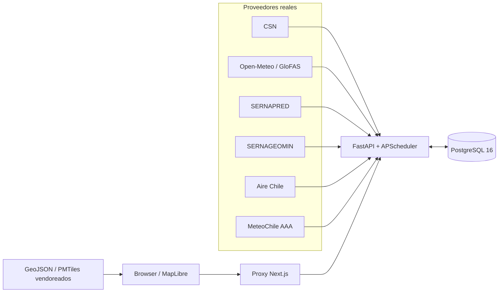

# ChileRisk — arquitectura

Vista cross-stack del sistema. La referencia de API está en [backend/docs/BACKEND.md](../backend/docs/BACKEND.md); el estado y la implementación cliente en [frontend/docs/FRONTEND.md](../frontend/docs/FRONTEND.md); el contrato de fecha en [QUERY-DATE.md](./QUERY-DATE.md). El routing de agentes parte en [../AGENTS.md](../AGENTS.md).

---

## Sistema

Los flujos de ingesta y consulta convergen en FastAPI. El navegador no accede directamente a PostgreSQL.



### Componentes

| Capa | Tecnología | Propósito |
|------|------------|-----------|
| Browser | Next.js 16, React 19, MapLibre, TanStack Query | Superficies ciudadanas, mapa y consultas por día |
| Proxy | Route handler Next `/api/backend` | Mantiene el origen del navegador y reenvía a FastAPI con JWT de cuenta o guest |
| API | FastAPI + Pydantic + SQLAlchemy async | Contrato HTTP, riesgo, alertas e integraciones |
| Proveedores | CSN, Open-Meteo/GloFAS, SERNAPRED, SERNAGEOMIN, Aire Chile, MeteoChile AAA | Ingestas reales de clima, inundación, sismos, alertas y calidad del aire |
| Base de datos | PostgreSQL 16 | Geografía, scores live, snapshots, eventos y caches de fuentes |
| Scheduler | APScheduler | Actualiza proveedores y recalcula datos derivados |
| Assets runtime | GeoJSON, PMTiles y snapshots JSON vendoreados | Cartografía y guías estáticas del frontend; no son ingestas backend |

---

## Flujo de datos

1. **Geografía:** el backend siembra 16 regiones y 346 comunas; el frontend sirve GeoJSON/PMTiles vendoreados desde `frontend/public/data/`.
2. **Sismos:** CSN (`sismologia.cl`) → `seismic_events`; `impact_service` precalcula impactos por comuna al insertar.
3. **Clima:** lotes Open-Meteo → `climate_readings` y actualización de scores.
4. **Inundación:** lotes Open-Meteo Flood/GloFAS → scores de inundación; el sync tolera el límite HTTP 429 con el corte documentado.
5. **Alertas oficiales:** SERNAPRED, SERNAGEOMIN, Aire Chile y MeteoChile AAA se sincronizan en tablas propias; la API unifica las alertas activas.
6. **Riesgo live:** `risk_service.recompute_all_scores` aplica datos e impactos al score actual según el scheduler.
7. **Riesgo histórico:** `daily_risk_service.get_or_compute_daily_scores` materializa y sirve snapshots por `score_date` dentro de la ventana de 30 días.
8. **Consulta web:** `frontend/lib/api.ts` → proxy Next → FastAPI; TanStack Query coordina caché, reconsulta y fecha global.

La semántica de la fecha civil de Chile está en [QUERY-DATE.md](./QUERY-DATE.md).

---

## Scheduler y fuentes

`backend/app/scheduler/jobs.py` es la fuente de los nueve jobs, sus intervalos y la condición común `ENABLE_SCHEDULER=true`. La tabla canónica está en [backend/docs/BACKEND.md#scheduler-y-lifespan](../backend/docs/BACKEND.md#scheduler-y-lifespan).

El `lifespan` de `backend/app/main.py` siembra catálogos y ejecuta sincronizaciones iniciales. El flood startup se agenda con `asyncio.create_task` para no bloquear el healthcheck; el scheduler se configura después de la inicialización.

Todas las integraciones operativas usan proveedores reales: [CSN](https://www.sismologia.cl), [Open-Meteo](https://open-meteo.com) y [GloFAS](https://www.globalfloods.eu/), [SERNAPRED](https://senapred.cl), [SERNAGEOMIN](https://www.sernageomin.cl/alertas-volcanicas/), [Aire Chile](https://airechile.mma.gob.cl/) y [MeteoChile AAA](https://archivos.meteochile.gob.cl/portaldmc/AAA/datos_AAA.json). Si una fuente falla o queda vacía, no se fabrica un valor de reemplazo.

---

## Contrato FE ↔ BE

El contrato se genera desde el backend y se verifica en la raíz:

```text
backend/app/schemas/ → OpenAPI runtime (/openapi.json)
    → make sync-contract
    → frontend/lib/api-schema.d.ts
```

`frontend/lib/types.ts` y `frontend/lib/api.ts` adaptan el contrato para la UI. OpenAPI runtime es la fuente canónica; las tablas humanas de [backend/docs/BACKEND.md](../backend/docs/BACKEND.md) deben actualizarse si divergen.

---

## Optimizaciones arquitectónicas

| Decisión | Ancla comprobable |
|----------|-------------------|
| Mapa cargado sin SSR | `frontend/app/(citizen)/monitor/page.tsx`: `next/dynamic` con `{ ssr: false }` |
| Polígonos pesados de evacuación | `frontend/lib/evacuacion-layers.ts`: PMTiles; líneas y puntos en GeoJSON |
| Geometría separada de niveles | `frontend/components/map/chile-map.tsx`: `setData` y `setFeatureState` |
| TTL live/histórico | `frontend/lib/query-cache.ts`: `staleTimeForLive` |
| Impacto sísmico precomputado | `backend/app/services/impact_service.py`: `recompute_all_scores` consume impactos |
| Lotes y tolerancia del proveedor | `backend/app/services/openmeteo_service.py` y `backend/app/services/flood_service.py` |
| Snapshots diarios y lock por fecha | `backend/app/services/daily_risk_service.py`: `get_or_compute_daily_scores` |
| Cuerpos de alerta bajo demanda | `backend/app/api/alerts.py`: `include_content=false` por defecto |

La tabla muestra decisiones de arquitectura; no incluye métricas ni promesas de latencia.

---

## Despliegue

`docker-compose.yml` en la raíz define el camino local y de despliegue:

| Servicio | Puerto | Notas |
|----------|--------|-------|
| `frontend` | 3000 | Next standalone; healthcheck local |
| `backend` | 8000 | FastAPI; healthcheck local; no se publica directamente |
| `db` | 5434 en host | PostgreSQL; no se publica a Internet |
| `adminer` | 8080 | Solo profile `tools` local |

`make up` equivale a `docker compose --profile tools up --build --detach` e incluye Adminer. El stack se ejecuta en segundo plano y devuelve el control a la terminal. Las plantillas de entorno son [`.env.example`](../.env.example) y [`backend/.env.example`](../backend/.env.example).

### Destino configurado: `chilerisk.cl`

El despliegue previsto usa Docker Compose en Dokploy/CubePath:

1. El servicio `frontend` atiende el dominio HTTPS en el puerto 3000.
2. El proxy del frontend reenvía `/api/backend` a `backend:8000` dentro de la red Docker.
3. El backend no necesita dominio público.
4. `AUTH_SECRET`, CORS, credenciales de PostgreSQL y claves opcionales se configuran por entorno; no se escriben en el repositorio.
5. El volumen `pgdata` persiste la base de datos y no se expone fuera del host.

El dominio es un destino de despliegue configurado. La prueba funcional documentada usa el stack local.

---

## Estructura del monorepo

Monorepo políglota sin Turborepo:

- **Ownership:** `AGENTS.md` por área; referencias de stack en `backend/docs/` y `frontend/docs/`; cross-stack en `docs/`.
- **Docker:** contextos separados `./frontend` y `./backend`.
- **Contrato:** OpenAPI runtime → `make sync-contract` → `frontend/lib/api-schema.d.ts`.
- **Frontend runtime:** assets GeoJSON/PMTiles y snapshots JSON vendoreados; no se leen desde PostgreSQL.
- **Makefile:** `up`, desarrollo nativo, `verify*`, sincronización de contrato y builders de datos.

Al añadir una nueva área, conserva el patrón de `AGENTS.md` y una referencia estable para su código.

---

*Last updated: 2026-08-12*
